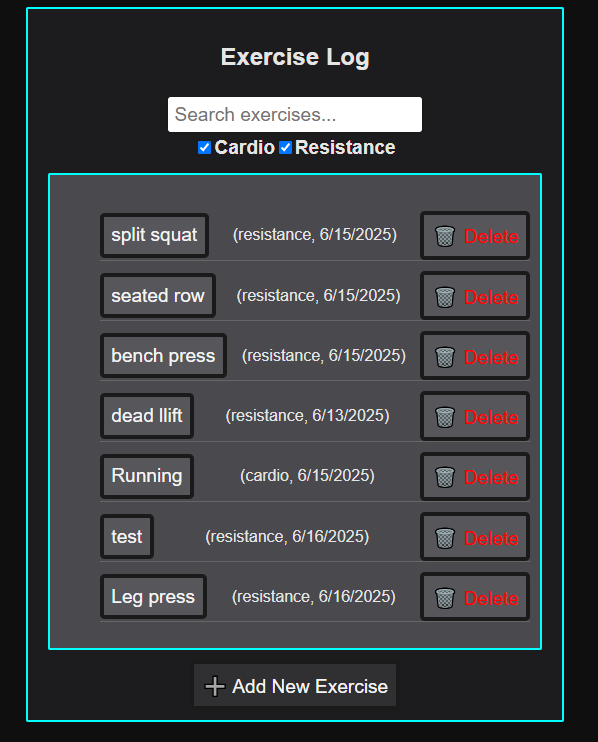
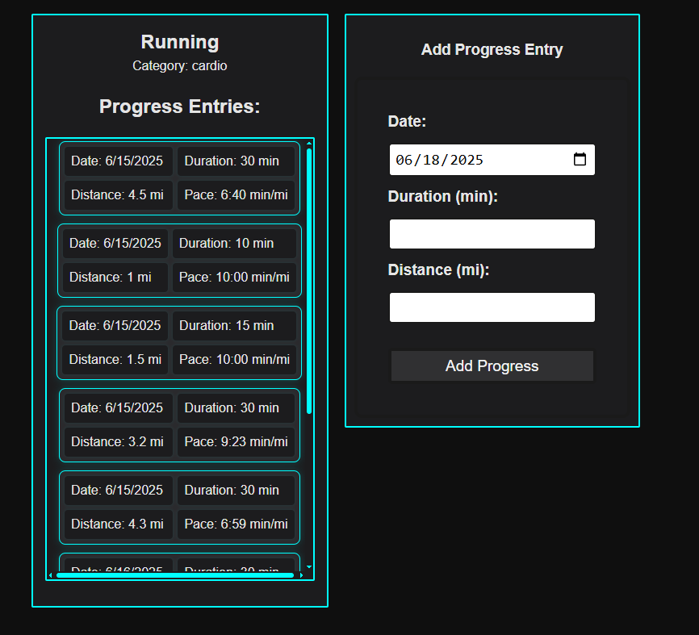
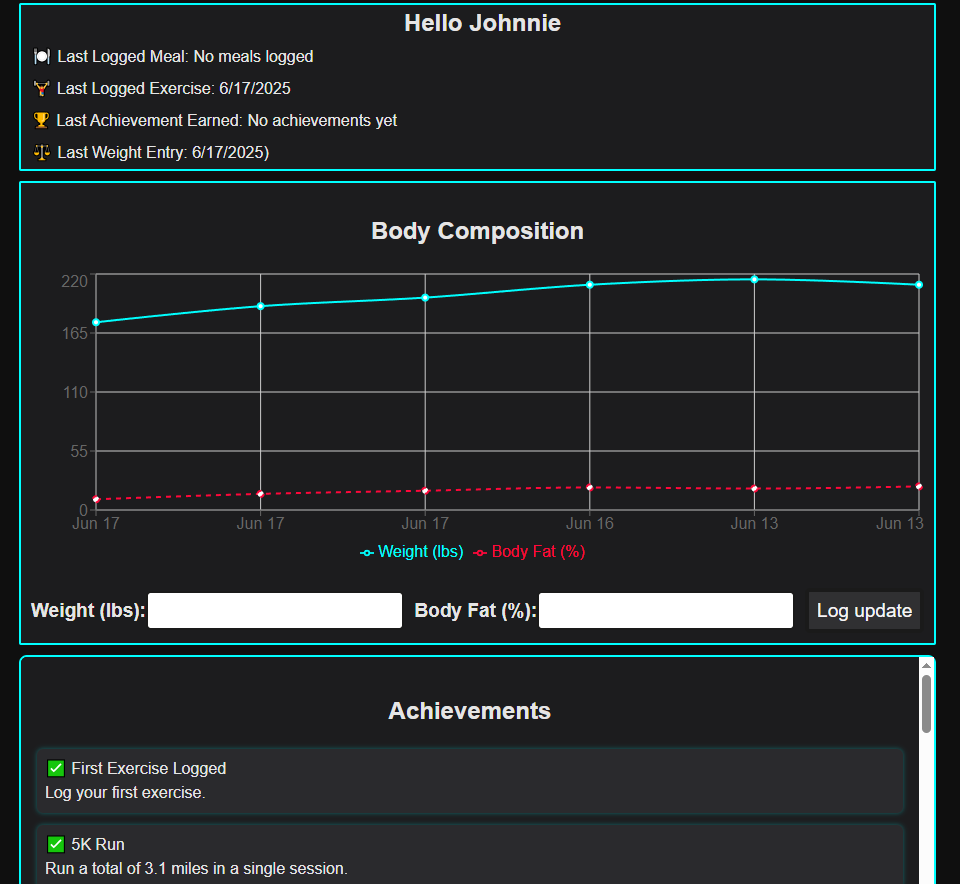

# myPR.IO

💪 myPR.IO — Your Personal Fitness & Wellness Tracker
myPR.IO is a full-stack fitness tracking app designed to help users take control of their health journey. Whether you're trying to lose weight, build strength, or establish healthier habits, myPR.IO provides intuitive tools to log your workouts, track meals, monitor progress, and celebrate milestones.

## 🧠 Background

This app was inspired by my 8 years of experience working in the fitness industry as a personal trainer. Over the years, I discovered that the average gym-goer struggles with consistency not because of lack of effort, but due to a lack of support in three key areas:

1. Positive Feedback — Encouragement and acknowledgment of progress, no matter how small.

2. Accessible Tools — A convenient and intuitive way to track workouts, meals, and body changes.

3. Visible Progress — The ability to see gradual improvements over time, even when those changes aren’t immediately obvious in the mirror.

myPR.IO was created to solve these problems — empowering users to stay motivated, informed, and inspired on their fitness journey.

## 🖼️ Screenshot

## 🚀 Technologies Used

- JavaScript
- HTML
- CSS
- Node.js
- Express
- MongoDB
- Mongoose
- REACT

## 🛠️ Getting Started

<!-- - [Click to View myPR.IO](https://elevateself-828b3b1b74f3.herokuapp.com/) -->

## 📈 Next Steps

Here are some features planned for future versions of Elevate:

- **Meal Traking** – In the Furture I will be adding Meal tracking features allowing you to calculate a daily calorie goal, Macros breakdown, and a calorie tracker

Known bugs
- some achevements will not unlock even after meeting the requirments

---

Feel free to fork this project, contribute, or provide feedback!

